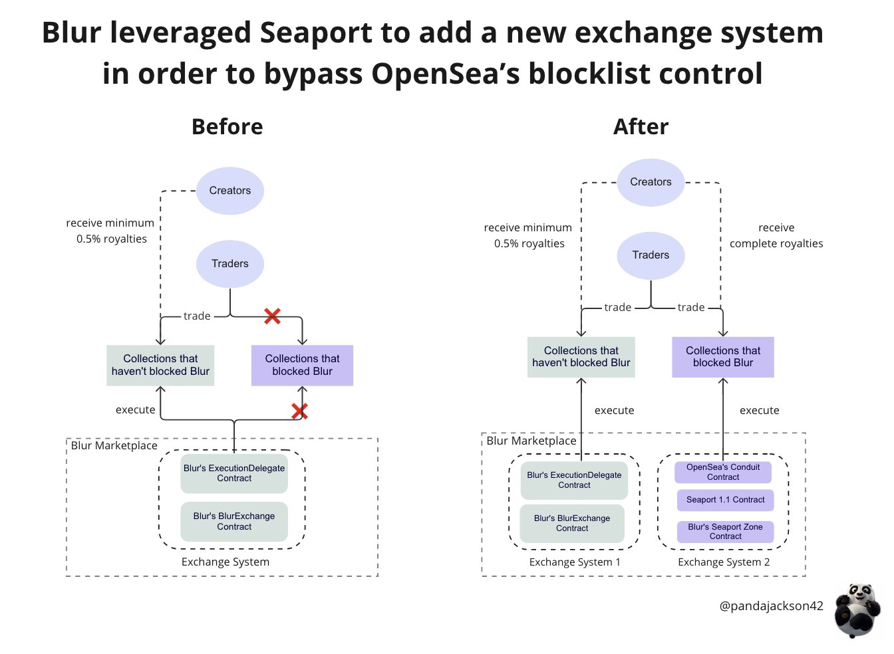

# blur-analysis

## 1. BlurSwap

<https://etherscan.io/address/0x39da41747a83aee658334415666f3ef92dd0d541>

BlurSwap 合约， fork 自 GemSwap。二者代码一致。

主要用于处理聚合交易相关逻辑。

## 2. BlurExchange

<https://etherscan.io/address/0x000000000000ad05ccc4f10045630fb830b95127>

BlurExchange 合约。Blur 自建的交易市场合约。

BlurExchange 的交易模型于 Opensea 一样是中央订单簿的交易模型，都是由链下的中心化的订单簿和链上的交易组成。

其中链下的订单簿负责存储用户的挂单信息，并对订单进行撮合。最终的成交和转移 NFT 是由 BlurExchange 来负责的。

### 2.1 代码地址

Blur 官方没有给出具体的代码仓库地址。不过我在 GitHub 上找到了下面这个代码仓库，应该是之前提交审计的时候留下来的。

<https://github.com/code-423n4/2022-10-blur>

ps: 这个代码库里的代码跟最新的实现合约有了不小的差别，仅做参考。

### 2.2 整体架构


<https://etherscan.io/viewsvg?t=1&a=0x39da41747a83aeE658334415666f3EF92DD0D541>


按照模块可以分为一下几类：

1. BlurExchange：主合约，负责交易的执行。
2. PolicyManager：订单交易策略管理者。
3. MatchingPolicy：订单交易策略，负责判断买单、买单是否可以匹配。
4. ExecutionDelegate：负责具体的转移代币的逻辑。

### 2.3 BlurExchange

这是一个 upgradeable 合约，因此会有不同版本的实现合约。

目前实现合约的地址是 <https://etherscan.io/address/0x983e96c26782a8db500a6fb8ab47a52e1b44862d>

#### 2.3.0 数据结构

```solidity
// 交易方向
enum Side { Buy, Sell }
// 签名类型
enum SignatureVersion { Single, Bulk }
// 资产类型
enum AssetType { ERC721, ERC1155 }

// 收费详情
struct Fee {
    uint16 rate; // 比率
    address payable recipient; // 接收者
}

// 订单数据
struct Order {
    address trader; // 订单创建者
    Side side; // 交易方向
    address matchingPolicy; // 交易策略
    address collection; // 合约地址
    uint256 tokenId; // tokenId
    uint256 amount; // 数量
    address paymentToken; // 支付的代币
    uint256 price; // 价格
    uint256 listingTime; // 挂单时间
    /* Order expiration timestamp - 0 for oracle cancellations. */
    uint256 expirationTime; // 过期时间，oracle cancellations 的是 0
    Fee[] fees; // 费用
    uint256 salt;
    bytes extraParams; // 额外数据，如果长度大于 0，且第一个元素是 1 则表示是oracle authorization
}

// 订单和签名数据
struct Input {
    Order order; // 订单数据
    uint8 v; 
    bytes32 r;
    bytes32 s;
    bytes extraSignature; // 批量订单校验和 Oracle 校验使用的额外数据
    SignatureVersion signatureVersion; // 签名类型
    uint256 blockNumber; // 挂单时的区块高度
}

// 交易双方的数据
struct Execution {
  Input sell;
  Input buy;
}

```

#### 2.3.1 需要注意的成员变量

##### 2.3.1.1 isOpen

交易开启和关闭的开关。

设置的时候会发出事件。

```solidity
    uint256 public isOpen;

    modifier whenOpen() {
        require(isOpen == 1, "Closed");
        _;
    }

    event Opened();
    event Closed();

    function open() external onlyOwner {
        isOpen = 1;
        emit Opened();
    }
    function close() external onlyOwner {
        isOpen = 0;
        emit Closed();
    }
```

##### 2.3.1.2 isInternal 和 remainingETH

`isInternal` 用来防止重入攻击，并限制 `_execute()` 函数只能通过被 `setupExecution` 修饰的函数调用，目前只有 `execute()` 和 `bulkExecute()` 被 `setupExecution` 修饰。

`remainingETH` 用来记录 `msg.sender` 的 ETH。交易过程中会根据订单信息来转移指定数量的 ETH，如果最后执行玩交易后还剩余的就通过 `_returnDust()` 转回给 `msg.sender`。

```solidity
    bool public isInternal = false;
    uint256 public remainingETH = 0;

    modifier setupExecution() {
        require(!isInternal, "Unsafe call"); // add redundant re-entrancy check for clarity
        remainingETH = msg.value;
        isInternal = true;
        _;
        remainingETH = 0;
        isInternal = false;
    }

    modifier internalCall() {
        require(isInternal, "Unsafe call");
        _;
    }
```

```solidity
function _returnDust() private {
        uint256 _remainingETH = remainingETH;
        assembly {
            if gt(_remainingETH, 0) {
                let callStatus := call(
                    gas(),
                    caller(),
                    _remainingETH,
                    0,
                    0,
                    0,
                    0
                )
                if iszero(callStatus) {
                  revert(0, 0)
                }
            }
        }
    }
```

##### 2.3.1.3 cancelledOrFilled

用于记录取消的和已成交订单信息。类型是 mapping，key是订单的 `orderHash`。

```solidity
    mapping(bytes32 => bool) public cancelledOrFilled;
```

正如之前说的 BlurExchange 是链下中心化订单簿的交易模型，所有的订单数据都存在链下。因此挂单的时候只需要进行签名，Blur 会将签名信息和订单信息放到自己的中心化服务器上，这个流程是不消耗 gas 的（当然授权 NFT 的操作还是需要消耗 gas）。

但是如果用户想要取消挂单，就需要调用 BlurExchange 合约的 `cancelOrder()` 方法将这个订单的 hash 设置到 `cancelledOrFilled` 这一成员变量中，这一个过程涉及到链上数据的修改，因此需要消耗 gas。

而且这一步是必须的。如果只在链下订单簿上将订单删除，没有设置 `cancelledOrFilled`。这时候其他人如果能在用户删除订单数据之前拿到这个订单数据和签名信息还是能通过 BlurExchange 合约进行成单的。而大部分交易所（比如 Opensea 和 Blur）的订单数据都是能通过特定 API 来获取的。

##### 2.3.1.4 nonces

用于记录用户的 nonce 。类型是 mapping，key是用户的 `address`。

```solidity
    mapping(address => uint256) public nonces;
```

这一数据主要来管理用户的订单。如果用户想要取消所有的订单，不需要一个个调用 `cancelOrder()` ，只需要调用 `incrementNonce()` 方法将 `nonces` 中存储的 nonce 值加 1 就行。

```solidity
    /**
     * @dev Cancel all current orders for a user, preventing them from being matched. Must be called by the trader of the order
     */
    function incrementNonce() external {
        nonces[msg.sender] += 1;
        emit NonceIncremented(msg.sender, nonces[msg.sender]);
    }
```

这是因为所有订单的 hash 都是通过订单数据和订单 `trader` 的 nonce 来生成的。而如果 nonce 的值改变了之后，订单的 hash 就会发生改变。这时候再去校验用户的签名的时候就会失败。从而使用户所有以之前 nonce 签名的的订单全部失效。具体校验逻辑可以看下面的 Signature Authentication。

```solidity
function _hashOrder(Order calldata order, uint256 nonce)
        internal
        pure
        returns (bytes32)
    {
        return keccak256(
            bytes.concat(
                abi.encode(
                      ORDER_TYPEHASH,
                      order.trader,
                      order.side,
                      order.matchingPolicy,
                      order.collection,
                      order.tokenId,
                      order.amount,
                      order.paymentToken,
                      order.price,
                      order.listingTime,
                      order.expirationTime,
                      _packFees(order.fees),
                      order.salt,
                      keccak256(order.extraParams)
                ),
                abi.encode(nonce)
            )
        );
    }
```

##### 2.3.1.4 其他一些成员变量

```solidity
    // ExecutionDelegate 合约的地址，用于执行代币转移
    IExecutionDelegate public executionDelegate;
    // PolicyManager 合约的地址，用于管理交易策略
    IPolicyManager public policyManager;
    // oracle 的地址，用于 oracle 签名交易的校验
    address public oracle;
    // 订单发起到成交时区块高度的最大范围，用于 Oracle Signature 类型的订单。
    uint256 public blockRange;

    // 收费比率
    uint256 public feeRate;
    // 费用接收地址
    address public feeRecipient;
    // 官方地址，设置费用比率的时候必须是这个官方地址发起的调用
    address public governor;
```

#### 2.3.2 Execute

订单的匹配通过 `execute()` 和 `bulkExecute()` 进行匹配。他们一个是单个订单匹配，一个是多个订单匹配。最终都会调用 `_execute()` 方法。

```solidity
function _execute(Input calldata sell, Input calldata buy)
        public
        payable
        internalCall
        reentrancyGuard 
    {
        require(sell.order.side == Side.Sell);

        // 计算订单 hash
        bytes32 sellHash = _hashOrder(sell.order, nonces[sell.order.trader]);
        bytes32 buyHash = _hashOrder(buy.order, nonces[buy.order.trader]);

        // 校验订单参数
        require(_validateOrderParameters(sell.order, sellHash), "Sell has invalid parameters");
        require(_validateOrderParameters(buy.order, buyHash), "Buy has invalid parameters");

        // 校验签名，order.trader == msg.sender 则不去校验直接返回 true
        require(_validateSignatures(sell, sellHash), "Sell failed authorization");
        require(_validateSignatures(buy, buyHash), "Buy failed authorization");

        // 校验买卖订单是否能匹配
        (uint256 price, uint256 tokenId, uint256 amount, AssetType assetType) = _canMatchOrders(sell.order, buy.order);

        /* Mark orders as filled. */
        // 存储订单状态
        cancelledOrFilled[sellHash] = true;
        cancelledOrFilled[buyHash] = true;
        
        // 执行资产转移
        _executeFundsTransfer(
            sell.order.trader,
            buy.order.trader,
            sell.order.paymentToken,
            sell.order.fees,
            price
        );

        // 执行 NFT 转移
        _executeTokenTransfer(
            sell.order.collection,
            sell.order.trader,
            buy.order.trader,
            tokenId,
            amount,
            assetType
        );

        // 发出事件
        emit OrdersMatched(
            // 买单时间大，表明此次是由买家触发，事件中的 maker 是买家。相反的 maker 是卖家表明是有卖家触发的订单。
            sell.order.listingTime <= buy.order.listingTime ? sell.order.trader : buy.order.trader, 
            sell.order.listingTime > buy.order.listingTime ? sell.order.trader : buy.order.trader,
            sell.order,
            sellHash,
            buy.order,
            buyHash
        );
    }
```

订单完成后发出 `OrdersMatched` 事件。

```solidity
    event OrdersMatched(
        address indexed maker,
        address indexed taker,
        Order sell,
        bytes32 sellHash,
        Order buy,
        bytes32 buyHash
    );
```

#### 2.3.3 canMatchOrders

在上面撮合订单的方法中会进行校验买卖单能否成交。具体的 matchingPolicy 分析见下文。

```solidity
function _canMatchOrders(Order calldata sell, Order calldata buy)
        internal
        view
        returns (uint256 price, uint256 tokenId, uint256 amount, AssetType assetType)
    {
        bool canMatch;
        if (sell.listingTime <= buy.listingTime) {
            /* Seller is maker. */
            // 校验订单的成交策略是否在白名单中
            require(policyManager.isPolicyWhitelisted(sell.matchingPolicy), "Policy is not whitelisted");
            // 调用具体的校验方法进行校验
            (canMatch, price, tokenId, amount, assetType) = IMatchingPolicy(sell.matchingPolicy).canMatchMakerAsk(sell, buy);
        } else {
            /* Buyer is maker. */
            require(policyManager.isPolicyWhitelisted(buy.matchingPolicy), "Policy is not whitelisted");
            (canMatch, price, tokenId, amount, assetType) = IMatchingPolicy(buy.matchingPolicy).canMatchMakerBid(buy, sell);
        }
        require(canMatch, "Orders cannot be matched");

        return (price, tokenId, amount, assetType);
    }
```

#### 2.3.4 Signature Authentication

由于采用链下中心化订单簿的交易模型，用户首先将 NFT 授权给 Blur，然后 Blur 在撮合成交的时候将 NFT 转移给买家。为了确保交易按照卖家的要求成交，因此需要卖家对订单信息进行签名。然后在成交的时候对签名进行校验，以此来保证交易的安全。

在 BlurExchange 中，可以一次签名一个订单，也可以一次签名多个订单。而且除了 User Authorization，还有 Oracle Authorization。下面会详细介绍。

所有的签名校验都通过 `_validateSignatures()` 方法进行。

```solidity
 function _validateSignatures(Input calldata order, bytes32 orderHash)
        internal
        view
        returns (bool)
    {   
        // 如果订单的 extraParams 中有数据，且第一个元素是 1 表示需要进行 Oracle Authorization
        if (order.order.extraParams.length > 0 && order.order.extraParams[0] == 0x01) {
            /* Check oracle authorization. */
            // 订单的挂单区块高度与当前成单时的区块高度的差值要小于 blockRange
            require(block.number - order.blockNumber < blockRange, "Signed block number out of range");
            if (
                !_validateOracleAuthorization(
                    orderHash,
                    order.signatureVersion,
                    order.extraSignature,
                    order.blockNumber
                )
            ) {
                return false;
            }
        }

        // 交易方与调用者相同的时候不用校验，因为这个交易是调用者自己触发的。
        if (order.order.trader == msg.sender) {
          return true;
        }

        /* Check user authorization. */
        if (
            !_validateUserAuthorization(
                orderHash,
                order.order.trader,
                order.v,
                order.r,
                order.s,
                order.signatureVersion,
                order.extraSignature
            )
        ) {
            return false;
        }

        return true;
    }
```

##### 2.3.4.1 User Authorization

订单中的 SignatureVersion 参数确定了两种类型的签名类型: 单一（Single）和批量（Bulk）。单个校验通过订单哈希的签名信息进行身份验证。批量则更为复杂一些。

###### Bulk SignatureVersion

批量校验签名用到了大家都很熟悉的 Merkle Tree。

要进行批量校验签名的时候，用户需要根据要签署的多个订单信息生成订单 hash。然后利用订单 hash 生成 Merkle Tree，并得到 Merkle Tree Root。最后将订单 hash 各自的 path 打包在订单数据的 extraSignature 中。这样在成交的时候利用订单 hash 和 proof 数据生成Merkle Tree Root，然后再验证签名信息。

```solidity
function _validateUserAuthorization(
        bytes32 orderHash,
        address trader,
        uint8 v,
        bytes32 r,
        bytes32 s,
        SignatureVersion signatureVersion,
        bytes calldata extraSignature
    ) internal view returns (bool) {
        bytes32 hashToSign;
        if (signatureVersion == SignatureVersion.Single) { // 单个签名
            /* Single-listing authentication: Order signed by trader */
            hashToSign = _hashToSign(orderHash);
        } else if (signatureVersion == SignatureVersion.Bulk) { // 批量签名
            /* Bulk-listing authentication: Merkle root of orders signed by trader */
            // 从 extraSignature 中解出 merkle tree 的路径
            (bytes32[] memory merklePath) = abi.decode(extraSignature, (bytes32[]));
            // 计算 merkle tree 的 root 节点
            bytes32 computedRoot = MerkleVerifier._computeRoot(orderHash, merklePath);
            hashToSign = _hashToSignRoot(computedRoot);
        }
        // 校验签名
        return _recover(hashToSign, v, r, s) == trader;
    }
```

##### 2.3.4.2 Oracle Authorization

这里的 Oracle 跟 Chainlink 那样的预言机没有什么关系，反而跟 NFT Mint 阶段进行签名校验的逻辑相似。

上面我们提到过 BlurExchange 合约中有一个 oracle 的成员变量。他是一个地址类型的变量。

```solidity
address public oracle;
```

如果要使用 Oracle Authorization 这项功能，用户需要选择授权 Oracle 这个地址对订单进行签名。然后将 Oracle 的签名信息放到订单的 extraSignature 这一参数中去。最后订单校验的时候会对这一签名信息进行校验，如果校验通过就可以进行接下来的校验。

Oracle Authorization 需要注意以下几点：

###### 1. Oracle Authorization 是可选的

Oracle Authorization 是可选的，User Authorization 是每次成单都必须进行的。

###### 2. Oracle Authorization 实现了链下取消订单的方法

因为 Oracle 这一账户对订单进行签名是在链下 Blur 中心化服务器上进行的。如果用户想要取消某个使用了 Oracle Authorization 方式的订单，只需要告诉 Blur 的服务器不再对其进行生成签名就可以了。

###### 3. blockNumber 和 blockRange

进行这种形式校验的订单需要提供订单创建时的区块高度信息（blockNumber）。并且在校验的时候，订单创建时候的区块高度与当前成单时候的区块高度的差值必须小于 `blockRange` 这一成员变量。

```solidity
/* Check oracle authorization. */
require(block.number - order.blockNumber < blockRange, "Signed block number out of range");
```

这样做的目的应该是是安全上面的考量。减少了签名的有效时间，防止签名的滥用。

###### 4. extraSignature 存储了批量订单校验和 Oracle 校验使用的额外数据

订单信息中的 `extraSignature` 是一个 `bytes` 类型的参数。

如果当前订单是一个单个校验订单，则 `extraSignature` 存储的只有 Oracle 校验使用的额外数据。为空则表示该单个校验订单不支持 Oracle Authorization。

如果当前订单是一个批量校验订单，则 `extraSignature` 存储的既有批量订单校验需要用到的Merkle Path 数据，也有 Oracle 校验使用的签名数据。

其中前 32 个字节是批量订单校验的 Merkle Path 数据，接着后面每 32 个字节都是一个签名数据。

##### _validateOracleAuthorization()

```solidity
function _validateOracleAuthorization(
        bytes32 orderHash,
        SignatureVersion signatureVersion,
        bytes calldata extraSignature,
        uint256 blockNumber
    ) internal view returns (bool) {
        bytes32 oracleHash = _hashToSignOracle(orderHash, blockNumber);

        uint8 v; bytes32 r; bytes32 s;
        if (signatureVersion == SignatureVersion.Single) {
            assembly {
                v := calldataload(extraSignature.offset)
                r := calldataload(add(extraSignature.offset, 0x20))
                s := calldataload(add(extraSignature.offset, 0x40))
            }
            /*
            REFERENCE
            (v, r, s) = abi.decode(extraSignature, (uint8, bytes32, bytes32));
            */
        } else if (signatureVersion == SignatureVersion.Bulk) {
            /* If the signature was a bulk listing the merkle path must be unpacked before the oracle signature. */
            assembly {
                v := calldataload(add(extraSignature.offset, 0x20))
                r := calldataload(add(extraSignature.offset, 0x40))
                s := calldataload(add(extraSignature.offset, 0x60))
            }
            /*
            REFERENCE
            uint8 _v, bytes32 _r, bytes32 _s;
            (bytes32[] memory merklePath, uint8 _v, bytes32 _r, bytes32 _s) = abi.decode(extraSignature, (bytes32[], uint8, bytes32, bytes32));
            v = _v; r = _r; s = _s;
            */
        }

        return _verify(oracle, oracleHash, v, r, s);
    }
```

#### 2.3.5 Token Transfer

买卖双方在授权代币的时候会向 ExecutionDelegate 授权。然后在订单成交的时候由 ExecutionDelegate 负责具体的转移代币的逻辑。

##### 2.3.5.1 货币的转移

通过下面的代码可以发现 Blur 只支持 ETH、WETH 和 BlurPool 作为支付货币。 其他的 ERC20 代币还不支持作为支付代币。

BlurPool 比较特殊，可以简单理解为 WETH。下面会详细介绍。

```solidity
// ETH or WETH or BlurPool 
function _transferTo(
        address paymentToken,
        address from,
        address to,
        uint256 amount
    ) internal {
        if (amount == 0) {
            return;
        }

        if (paymentToken == address(0)) {
            /* Transfer funds in ETH. */
            require(to != address(0), "Transfer to zero address");
            (bool success,) = payable(to).call{value: amount}("");
            require(success, "ETH transfer failed");
        } else if (paymentToken == POOL) {
            /* Transfer Pool funds. */
            bool success = IBlurPool(POOL).transferFrom(from, to, amount);
            require(success, "Pool transfer failed");
        } else if (paymentToken == WETH) {
            /* Transfer funds in WETH. */
            executionDelegate.transferERC20(WETH, from, to, amount);
        } else {
            revert("Invalid payment token");
        }
    }
```

##### 2.3.5.2 资产的转移

```solidity
// NFT 的转移
function _executeTokenTransfer(
        address collection,
        address from,
        address to,
        uint256 tokenId,
        uint256 amount,
        AssetType assetType
    ) internal {
        /* Call execution delegate. */
        if (assetType == AssetType.ERC721) {
            executionDelegate.transferERC721(collection, from, to, tokenId);
        } else if (assetType == AssetType.ERC1155) {
            executionDelegate.transferERC1155(collection, from, to, tokenId, amount);
        }
    }
```

## 3. PolicyManager

<https://etherscan.io/address/0x3a35A3102b5c6bD1e4d3237248Be071EF53C8331>

用于管理所有的交易策略。

包括交易策略的添加，移除和查看等功能。

### 3.1 MatchingPolicy

结合 PolicyManager 的 Event 信息，可以找到目前 PolicyManager 白名单中有三种交易策略：

1. StandardPolicyERC721（normal）: <https://etherscan.io/address/0x00000000006411739DA1c40B106F8511de5D1FAC>
2. StandardPolicyERC721（oracle）: <https://etherscan.io/address/0x0000000000daB4A563819e8fd93dbA3b25BC3495>
3. SafeCollectionBidPolicyERC721: <https://etherscan.io/address/0x0000000000b92D5d043FaF7CECf7E2EE6aaeD232>

注意前两个是不同的合约，具体的策略也有一些区别。

其中 StandardPolicyERC721（normal）和 StandardPolicyERC721（oracle）基本逻辑差不多，不同的是 oracle 类型的策略要求必须用于支持 Oracle Authorization 的订单。

SafeCollectionBidPolicyERC721 策略中不对 token id 进行校验而且 canMatchMakerAsk 方法直接 revert。这说明使用这种策略的订单只能进行接受出价（bid），不能直接 listing。这跟 Blur 中的 bid 功能有关。后面再详细介绍。

## 4. BlurPool

Todo

## 5. Seaport 和 版税

Todo



## 6. 总结

整体看来 Blur 给人的感觉还是挺简洁的。

批量签名、预言机签名这些新功能会有有很大的应用空间。

目前 Blur 应该还是在很早期的阶段，毕竟他只支持了 ERC721 的限价单的交易方式。不支持 ERC1155 的交易，也不支持拍卖功能。当然这些应该都在他们的开发计划中。通过 MatchingPolicy 可以很方便的添加新的交易策略。这一点跟 BendDao 的 Execution Strategy 很像。猜测大概率是借鉴过来的。（关于 BendDao 更多的信息可以查看我的另一篇文章：[BendDAO-analysis](https://github.com/cryptochou/BendDAO-analysis#execution-strategy%E6%89%A7%E8%A1%8C%E7%AD%96%E7%95%A5)）

虽然是很早起的阶段，但是 Blur 目前的交易量大有赶超 Opensea 之势。应该是明确的空投预期起到了很大的作用。毕竟天下苦 Opensea 久矣。🤣

---

2023 03-01 Updata

Todo


## 7. 参考

https://twitter.com/pandajackson42/status/1620081518575235073
https://mirror.xyz/blurdao.eth/vYOjzk4cQCQ7AtuJWWiZPoNZ04YKQmTMsos0NNq_hYs
